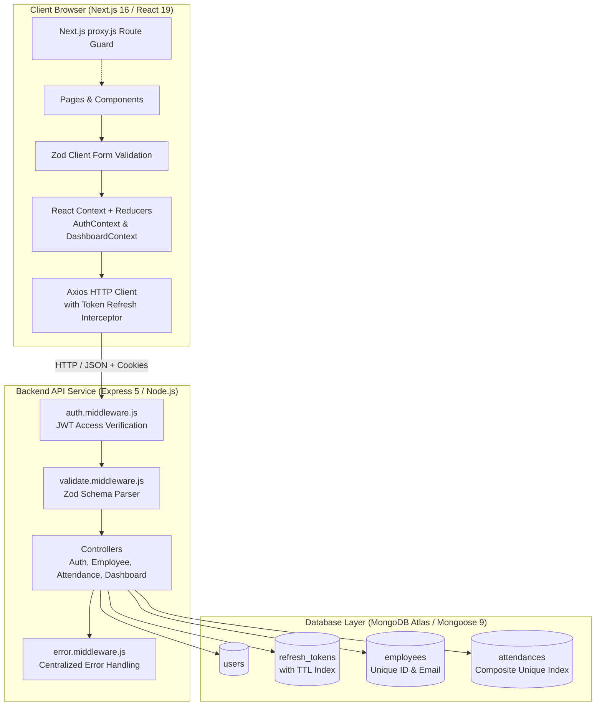
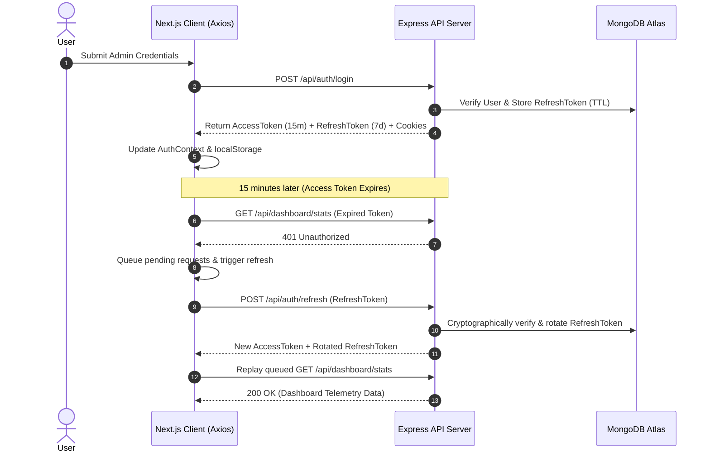

# System Architecture & Subsystem Design

This document details the software architecture, design patterns, subsystem boundaries, data flow pipelines, and complete monorepo folder structure of the Pramyan HR Management System.

---

## 1. Monorepo Organization & File Tree

The repository is organized as a clean **`pnpm` workspace monorepo** separating the backend REST API service from the frontend Next.js 16 web application.

```
Pramyan_Assignment/
├── package.json                   # Root package definition & workspace scripts
├── pnpm-workspace.yaml            # Monorepo packages definition (backend + frontend)
├── pnpm-lock.yaml                 # Unified dependency lockfile
├── requirements.pdf               # Assignment specification
├── .gitignore                     # Single root gitignore file
├── README.md                      # Primary project overview and setup
│
├── scripts/
│   └── dev.sh                     # Master runner (port cleaning, seeding, pre-build & launcher)
│
├── docs/                          # Comprehensive documentation suite
│   ├── ARCHITECTURE.md            # System architecture, state management & subsystem design
│   ├── API_DOCUMENTATION.md       # Complete REST API specification & Zod schemas
│   ├── DATABASE_SCHEMA.md         # MongoDB schemas, ER diagram & index definitions
│   ├── UI_UX_DESIGN_SYSTEM.md     # Stitch Corporate design tokens & UI components
│   ├── SETUP_AND_DEPLOYMENT.md    # Local setup, environment config & cloud deployment
│   ├── DECISIONS_AND_ASSUMPTIONS.md # Engineering decisions, trade-offs & assumptions
│   └── demo-walkthrough.mov       # Screen recording video walkthrough
│
├── backend/                       # REST API Server (Express.js 5 & Node.js, Port 5001)
│   ├── config/
│   │   └── db.js                  # MongoDB Atlas connection handler
│   ├── controllers/
│   │   ├── auth.controller.js     # Dual-token auth, cookie handler & token rotation
│   │   ├── employee.controller.js # Employee CRUD + search + filter
│   │   ├── attendance.controller.js# Attendance roll call & history logs
│   │   └── dashboard.controller.js# Workforce telemetry & 28-day aggregation pipelines
│   ├── middleware/
│   │   ├── auth.middleware.js     # Access token verification (Header & Cookie fallback)
│   │   ├── error.middleware.js    # Global centralized error handler
│   │   └── validate.middleware.js # Generic Zod schema validation middleware
│   ├── models/
│   │   ├── User.js                # Administrator schema
│   │   ├── RefreshToken.js        # MongoDB TTL refresh token session schema
│   │   ├── Employee.js            # 8-field employee schema with unique indexes
│   │   └── Attendance.js          # Composite unique index { employeeId, date }
│   ├── routes/
│   │   ├── auth.routes.js         # Auth routes with Zod validation
│   │   ├── employee.routes.js     # Employee routes with Zod validation
│   │   ├── attendance.routes.js   # Attendance routes with Zod validation
│   │   └── dashboard.routes.js    # Dashboard telemetry routes
│   ├── validations/
│   │   ├── auth.validation.js     # Zod login & refresh schemas
│   │   ├── employee.validation.js # Zod employee creation & update schemas
│   │   └── attendance.validation.js# Zod attendance roll call schema
│   ├── seed.js                    # Database seeder (26 employees & 30-day attendance logs)
│   ├── server.js                  # Express application entry point & CORS configuration
│   ├── package.json               # Backend dependencies & scripts
│   ├── .env                       # Backend local environment configuration
│   └── .env.example               # Backend environment template
│
└── frontend/                      # Web Dashboard (Next.js 16 App Router & React 19, Port 3000)
    ├── app/
    │   ├── dashboard/
    │   │   ├── attendance/
    │   │   │   └── page.jsx       # Daily roll call, calendar & attendance history drawer
    │   │   ├── employees/
    │   │   │   └── page.jsx       # Employee directory table, search, filters & CSV export
    │   │   ├── layout.jsx         # Dashboard shell (Sidebar + Topbar wrapper)
    │   │   └── page.jsx           # Executive overview metrics & chart visualizations
    │   ├── login/
    │   │   └── page.jsx           # Login page with 1-click autofill & Zod validation
    │   ├── globals.css            # Corporate light theme styles & Tailwind CSS v4 tokens
    │   ├── layout.js              # Pure JavaScript root HTML layout & metadata
    │   ├── page.js                # Root redirection to /dashboard or /login
    │   └── providers.jsx          # React Context Provider wrapper (Auth + Dashboard)
    ├── components/
    │   ├── EmployeeModal.jsx      # Add / Edit Employee modal with client-side Zod validation
    │   ├── Sidebar.jsx            # Fixed navigation rail & logout action
    │   ├── StatCard.jsx           # Executive metric card with status badges
    │   └── Topbar.jsx             # System status strip & administrator profile badge
    ├── context/
    │   ├── AuthContext.jsx        # Authentication session management & cookies
    │   └── DashboardContext.jsx   # Global shared state for workforce metrics & roster
    ├── reducers/
    │   ├── authReducer.js         # Auth state transitions & action types
    │   └── dashboardReducer.js    # Dashboard state transitions & action types
    ├── lib/
    │   ├── api.js                 # Configured Axios client with automatic 401 token refresh queue
    │   └── validations.js         # Client-side Zod schemas for employee & login forms
    ├── next.config.mjs            # Next.js configuration with /api/* proxy rewrites
    ├── proxy.js                   # Edge route guard checking dual-token cookies
    ├── jsconfig.json              # Path aliases configuration (@/*)
    ├── postcss.config.mjs         # PostCSS configuration with Tailwind v4
    ├── package.json               # Frontend dependencies & scripts
    ├── README.md                  # Frontend package documentation
    ├── .env                       # Frontend local environment configuration
    └── .env.example               # Frontend environment template
```

---

## 2. High-Level Subsystem Architecture



---

## 3. Authentication & Dual-Token Rotation Flow

The platform implements an enterprise-grade **Dual-Token Authentication Lifecycle**:

1. **Access Token (Short-lived 15m)**:
   - Signed with `JWT_ACCESS_SECRET`.
   - Carried in `Authorization: Bearer <token>` header and the `accessToken` cookie.
   - Verified statelessly in `auth.middleware.js` on protected routes.
2. **Refresh Token (Long-lived 7d)**:
   - Signed with dedicated `JWT_REFRESH_SECRET`.
   - Stored in MongoDB Atlas (`refresh_tokens` collection) with a native MongoDB **TTL (Time-To-Live) index** on `expiresAt` for automatic database cleanup.
   - Transmitted securely via HTTP-only cookie and request body.
3. **Automatic 401 Interception & Request Replay Queue**:
   - In `frontend/lib/api.js`, when a request returns `401 Unauthorized`, the Axios response interceptor intercepts the failure.
   - Subsequent concurrent requests are queued into a `failedQueue`.
   - A single token refresh call (`POST /api/auth/refresh`) is dispatched to rotate the refresh token and obtain a fresh access token.
   - All pending requests in the queue are seamlessly replayed with the new access token without user disruption.



---

## 4. Frontend State Management Architecture

State is managed cleanly through **React Context + `useReducer`**:

- **`AuthContext.jsx` & `authReducer.js`**:
  - Manages session lifecycle (`INIT_AUTH`, `LOGIN_START`, `LOGIN_SUCCESS`, `LOGIN_FAILURE`, `LOGOUT`, `CLEAR_ERROR`).
  - Synchronizes session state across `localStorage`, cookies (for SSR/edge route inspection), and in-memory reducer state.
- **`DashboardContext.jsx` & `dashboardReducer.js`**:
  - Centralizes application data (`SET_STATS`, `SET_EMPLOYEES`, `SET_ATTENDANCE`, `ADD_EMPLOYEE`, `UPDATE_EMPLOYEE`, `DELETE_EMPLOYEE`, `SET_LOADING`, `SET_ERROR`).
  - Provides synchronized optimistic state updates across all dashboard screens (e.g., adding an employee updates the employee directory and recalculates department distribution telemetry immediately).
- **`providers.jsx`**:
  - Encapsulates `AuthProvider` and `DashboardProvider` in a single client wrapper at the root layout.

---

## 5. Validation Pipeline (Zod on Backend & Frontend)

- **Backend Validation**:
  - Every mutation endpoint is guarded by `validate.middleware.js` using strict Zod schemas (`validations/auth.validation.js`, `validations/employee.validation.js`, `validations/attendance.validation.js`).
  - Ensures clean error responses (`400 Bad Request`) with detailed field-level error messages before reaching controller logic.
- **Frontend Validation**:
  - Client-side form handlers in `EmployeeModal.jsx` and `login/page.jsx` validate input against schemas in `frontend/lib/validations.js` before network dispatch, providing real-time feedback.

---

## 6. Workforce Analytics & Telemetry Pipelines

Workforce analytics in `backend/controllers/dashboard.controller.js` utilize MongoDB aggregation pipelines:

- **Department Headcount Breakdown**: Aggregates employee counts grouped by `$department` sorted descending.
- **Today's Roll Call Status**: Aggregates attendance status counts (`Present`, `Absent`, `On Leave`) matching today's ISO date string `YYYY-MM-DD`.
- **28-Day & 7-Day Trend Analysis**:
  - Aggregates daily attendance distributions over the past 28 days (`$gte twentyEightDaysAgoStr`).
  - Computes historical presence rates, leave percentages, total logged days, and identifies peak attendance days.
