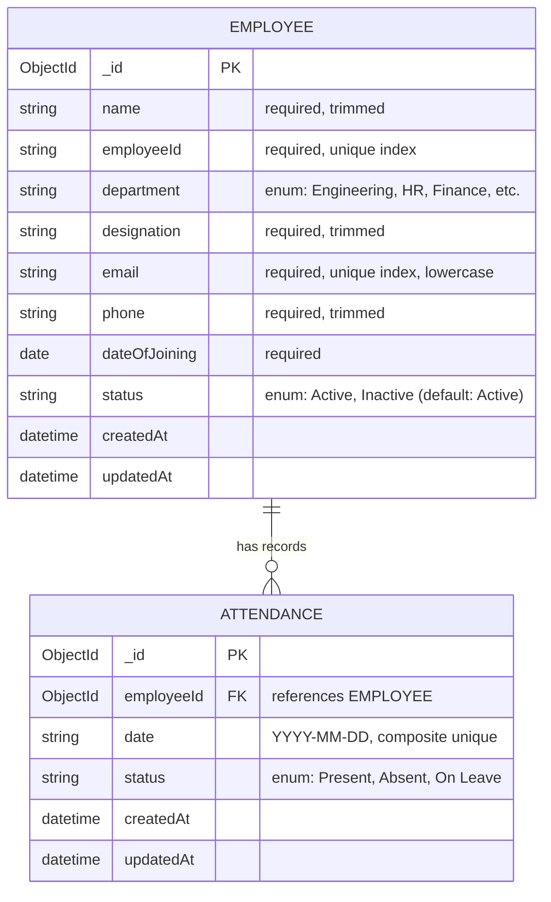

# Database Schema & Data Models

The database uses **MongoDB** with **Mongoose ODM**.

---

## 1. Entity Relationship Diagram

---

## 2. Collections & Indexes

### Collection: `employees`

| Field | Type | Required | Constraints / Default | Description |
|-------|------|----------|----------------------|-------------|
| `_id` | `ObjectId` | Auto | Primary Key | Auto-generated document ID |
| `name` | `String` | Yes | Trimmed | Employee's full legal name |
| `employeeId` | `String` | Yes | Unique index, trimmed | Unique alphanumeric company ID (e.g., `EMP001`) |
| `department` | `String` | Yes | Enum: 8 defined depts | Department assignment |
| `designation` | `String` | Yes | Trimmed | Job title or role |
| `email` | `String` | Yes | Unique index, lowercase | Official work email address |
| `phone` | `String` | Yes | Trimmed | Contact phone number |
| `dateOfJoining` | `Date` | Yes | Valid date | Employment start date |
| `status` | `String` | Yes | `Active` or `Inactive` | Default: `'Active'` |
| `createdAt` | `Date` | Auto | Timestamp | Document creation time |
| `updatedAt` | `Date` | Auto | Timestamp | Document last modified time |

**Indexes:**
- `{ employeeId: 1 }` — Unique
- `{ email: 1 }` — Unique

---

### Collection: `attendances`

| Field | Type | Required | Constraints / Default | Description |
|-------|------|----------|----------------------|-------------|
| `_id` | `ObjectId` | Auto | Primary Key | Auto-generated document ID |
| `employeeId` | `ObjectId` | Yes | Ref: `Employee` | Reference to employee |
| `date` | `String` | Yes | Format: `YYYY-MM-DD` | Date of attendance roll call |
| `status` | `String` | Yes | Enum: `Present`, `Absent`, `On Leave` | Daily check-in status |
| `createdAt` | `Date` | Auto | Timestamp | Document creation time |
| `updatedAt` | `Date` | Auto | Timestamp | Document last modified time |

**Composite Unique Index:**
- `{ employeeId: 1, date: 1 }` — Unique (Guarantees one attendance log per employee per day; prevents duplicate rows and enables idempotent upserts).
