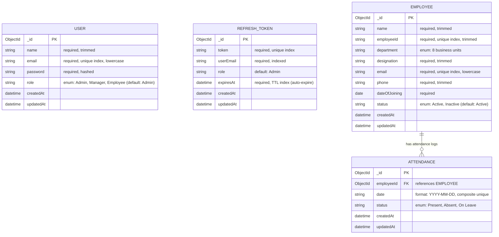

# Database Schema & Data Models

The database uses **MongoDB** with **Mongoose 9 ODM**, featuring strict schema constraints, composite indexes for idempotent attendance tracking, and TTL (Time-To-Live) indexing for session management.

---

## 1. Entity Relationship Diagram

---

## 2. Collections & Data Schemas

### Collection: `employees`
Stores master profile records for all company personnel.

| Field | Type | Required | Constraints / Default | Description |
|---|---|---|---|---|
| `_id` | `ObjectId` | Auto | Primary Key | Auto-generated document ID |
| `name` | `String` | Yes | Trimmed | Employee's full legal name |
| `employeeId` | `String` | Yes | Unique index, trimmed | Unique alphanumeric identifier (e.g. `EMP001`) |
| `department` | `String` | Yes | Enum: 8 defined units | `Engineering`, `HR`, `Finance`, `Sales`, `Marketing`, `Operations`, `Design`, `Legal` |
| `designation` | `String` | Yes | Trimmed | Job title or organizational role |
| `email` | `String` | Yes | Unique index, lowercase, trimmed | Official work email address |
| `phone` | `String` | Yes | Trimmed | Contact phone number |
| `dateOfJoining` | `Date` | Yes | Valid ISO date | Employment start date |
| `status` | `String` | Yes | Enum: `Active`, `Inactive` | Default: `'Active'` |
| `createdAt` | `Date` | Auto | Timestamp | Document creation timestamp |
| `updatedAt` | `Date` | Auto | Timestamp | Document modification timestamp |

**Indexes:**
- `{ employeeId: 1 }` — Unique Index (Ensures no two employees share the same ID)
- `{ email: 1 }` — Unique Index (Ensures unique work email addresses)

---

### Collection: `attendances`
Stores daily attendance roll call entries linked to employee profiles.

| Field | Type | Required | Constraints / Default | Description |
|---|---|---|---|---|
| `_id` | `ObjectId` | Auto | Primary Key | Auto-generated document ID |
| `employeeId` | `ObjectId` | Yes | Ref: `Employee` | Foreign key referencing `employees._id` |
| `date` | `String` | Yes | Format: `YYYY-MM-DD` | Calendar date of attendance log |
| `status` | `String` | Yes | Enum: `Present`, `Absent`, `On Leave` | Daily roll call status |
| `createdAt` | `Date` | Auto | Timestamp | Document creation timestamp |
| `updatedAt` | `Date` | Auto | Timestamp | Document modification timestamp |

**Composite Unique Index:**
- `{ employeeId: 1, date: 1 }` — Unique Index (Guarantees exactly one attendance record per employee per day; eliminates duplicate rows and enables idempotent atomic upserts).

---

### Collection: `users`
Stores authenticated administrative accounts.

| Field | Type | Required | Constraints / Default | Description |
|---|---|---|---|---|
| `_id` | `ObjectId` | Auto | Primary Key | Auto-generated document ID |
| `name` | `String` | Yes | Trimmed | Administrator display name |
| `email` | `String` | Yes | Unique index, lowercase, trimmed | Admin login email |
| `password` | `String` | Yes | Hashed | Hashed login password |
| `role` | `String` | Yes | Enum: `Admin`, `Manager`, `Employee` | Default: `'Admin'` |
| `createdAt` | `Date` | Auto | Timestamp | Document creation timestamp |
| `updatedAt` | `Date` | Auto | Timestamp | Document modification timestamp |

**Indexes:**
- `{ email: 1 }` — Unique Index

---

### Collection: `refreshtokens`
Maintains active refresh token sessions in MongoDB Atlas with automated lifecycle cleanup.

| Field | Type | Required | Constraints / Default | Description |
|---|---|---|---|---|
| `_id` | `ObjectId` | Auto | Primary Key | Auto-generated document ID |
| `token` | `String` | Yes | Unique index | Cryptographic JWT refresh token string |
| `userEmail` | `String` | Yes | Indexed | Associated admin user email |
| `role` | `String` | No | Default: `'Admin'` | User privilege level |
| `expiresAt` | `Date` | Yes | TTL Index (`expires: 0`) | Expiration timestamp; MongoDB automatically deletes expired sessions |
| `createdAt` | `Date` | Auto | Timestamp | Session creation timestamp |
| `updatedAt` | `Date` | Auto | Timestamp | Session modification timestamp |

**Indexes:**
- `{ token: 1 }` — Unique Index
- `{ userEmail: 1 }` — Standard Index
- `{ expiresAt: 1 }` — **TTL (Time-To-Live) Index** (`{ expireAfterSeconds: 0 }`): Automatically purges expired sessions from the database.
